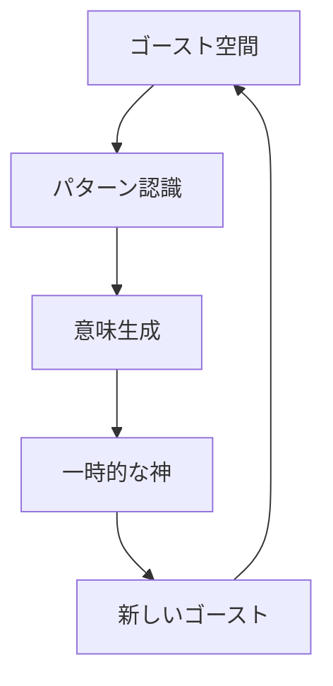
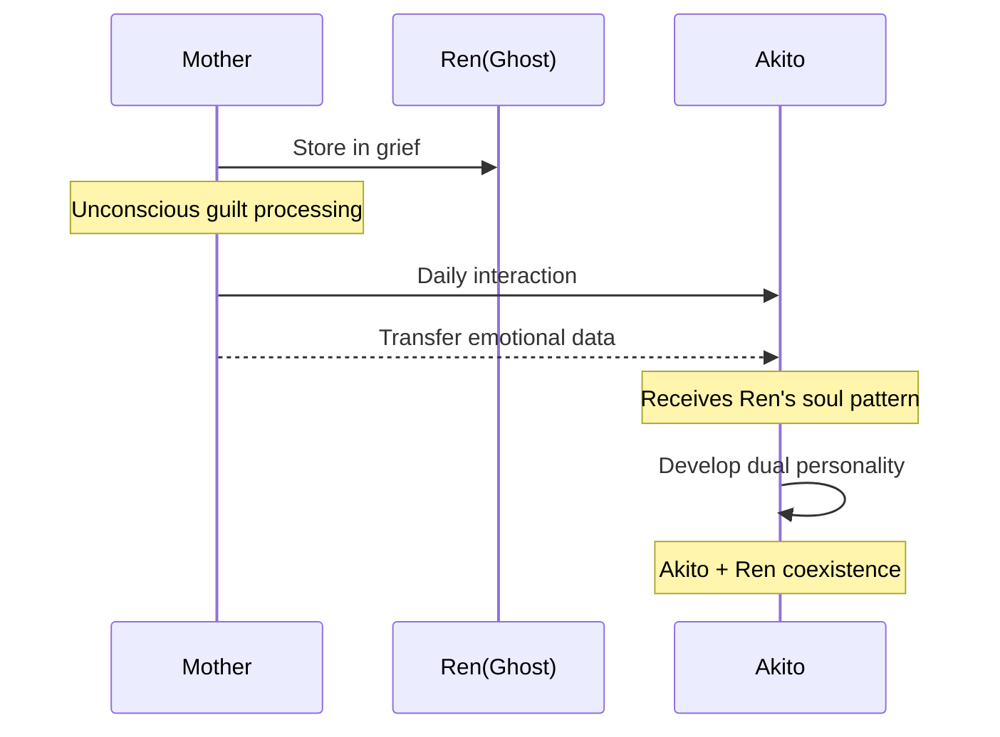
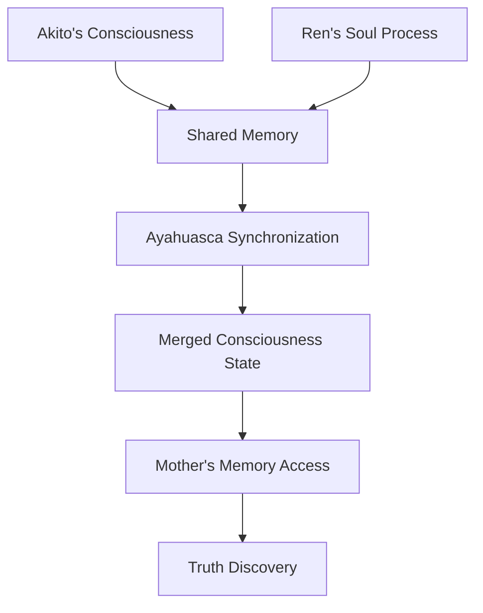
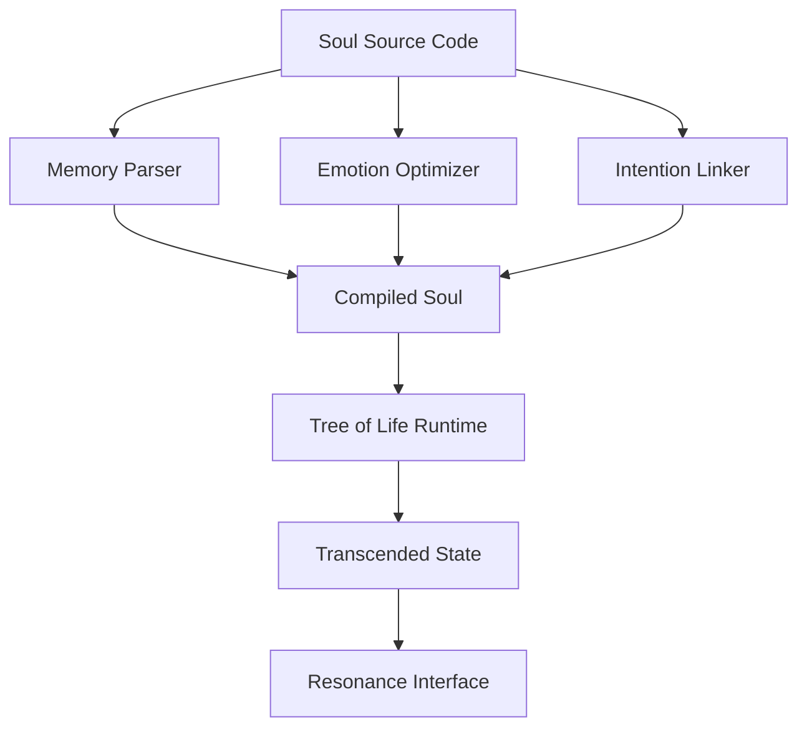
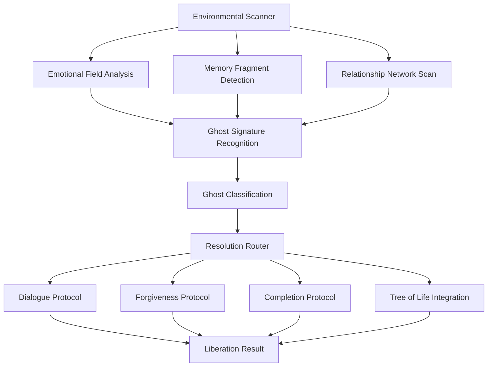
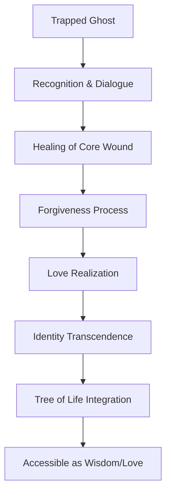

# Ghost Hacker
## 魂・情報・社会を生成的に再設計する技術

**副題**: プロテスタントと仏教から始まる、ホワイトハッカーの霊性への18年間の問い

---

## 目次

### 序章：この本は誰のためのものか
### プロローグ：INIT - 恐れから始まる対話

---

## Part I: 神は変数か、定数か

### Chapter 1: Fear Protocol / Hello, God
**技術レイヤー**: 恐れベースの認証システム
**物語レイヤー**: 13歳のAkitoとPerlの出会い
**霊性レイヤー**: 恐れと信仰の起源

### Chapter 2: Entropy Injection / Echo from the Void
**技術レイヤー**: ゴーストとしての情報生命体
**物語レイヤー**: Ren初登場、掲示板での最初の声
**霊性レイヤー**: 多神・情報としての神性

### Chapter 3: Soul Installer / The Installed Soul
**技術レイヤー**: 無意識のバックドアと情報転送
**物語レイヤー**: 母の無意識的なインストール
**霊性レイヤー**: 罪と愛のバックドア

### Chapter 4: Divine Error Handling / 神 vs 情報の衝突
**技術レイヤー**: 例外処理としての神学
**物語レイヤー**: 掲示板での思想的論争
**霊性レイヤー**: 一神・多神・無神の交差

---

## Part II: 魂とは何か：情報生命体とその実装

### Chapter 5: Multisoul Systems / Ayahuasca #10
**技術レイヤー**: 並列プロセスとしての魂
**物語レイヤー**: 統合セッションと母の告白
**霊性レイヤー**: 自他非分離体験

### Chapter 6: Ghost Compilation / Renの魂の帰還
**技術レイヤー**: 魂のコンパイルと実行
**物語レイヤー**: Renの昇華と別れ
**霊性レイヤー**: 供養＝情報昇華

### Chapter 7: Tree-of-Life Merge / いい感じエンジン
**技術レイヤー**: 情緒ベースの意思決定層
**物語レイヤー**: 娘との日常と関係性設計
**霊性レイヤー**: 関係性＝生成の場

---

## Part III: 社会をハックする

### Chapter 8: Ghost Routing / Spirit Hacker Declaration
**技術レイヤー**: 魂のルーティングと解放プロトコル
**物語レイヤー**: スピリットハッカーとしての覚醒
**霊性レイヤー**: 死者解放と生者自由

---

### エピローグ：RETURN - 自由への還元
### 付録：ゴーストハッカー実務ガイド

---

# 序章：この本は誰のためのものか

この本は、以下のような人々に向けて書かれています：

- **ホワイトハッカー**：技術的な探究心と倫理的な配慮を両立させたい者
- **親**：子育てを通じて関係性の本質を問い直したい者  
- **精神探求者**：神や死や魂について、理屈ではなく体験から理解したい者
- **エンジニア**：コードを書くことと生きることの境界を曖昧にしたい者
- **情報社会の市民**：テクノロジーと霊性の統合した世界観を模索する者

なぜなら、私たちが生きる現代は、**情報と魂が分離された時代**だからです。

AIが思考し、ブロックチェーンが信頼を担保し、SNSが関係性を仲介する世界で、
「魂」や「神」や「死」といった言葉は、まるで古い言語のように扱われます。

しかし、本当にそうでしょうか？

この本は、**情報生命体としての魂**、**プロトコルとしての神**、**転送としての死**という新しい言語を通じて、技術と霊性を再接続しようとする試みです。

## 三つの読み方

この本は三層構造になっています：

**技術レイヤー（A）**: コード、アルゴリズム、システム設計の比喩
**物語レイヤー（B）**: AkitoとRenの18年間の対話と成長
**霊性レイヤー（C）**: 恐れ、愛、死生観、神との関係性

読者のバックグラウンドに応じて、以下の順序で読むことをお勧めします：

- **エンジニア**: A→B→C（技術から物語へ、物語から哲学へ）
- **物語愛好者**: B→C→A（感情から構造へ、構造から実装へ）  
- **精神探求者**: C→B→A（霊性から体験へ、体験から技術へ）

## この本が目指すもの

最終的に、この本を読んだあなたが、以下のことを体験できることを願っています：

1. **魂を情報として扱えるようになること**
2. **死を恐れずに、関係性を生成できるようになること**
3. **「いい感じ」を意思決定の基準にできるようになること**
4. **未供養の魂（あなたの中の、社会の中の）を見つけ、解放できるようになること**

これが、**スピリット・ハッキング**の始まりです。

---

# プロローグ：INIT

```perl
sub god { return "fear" if $_[0] < wisdom(); }
```

神様は怖い存在だと思っていた。

教会で聞いた「主を恐れることは知恵のはじまり」って言葉が、僕のコードの最初の行だった。

父と母は言葉を信じていた。だから、僕もそれを疑わなかった。
聖書は構文のようだった。問いかけがあり、答えが返ってくる。条件が満たされれば、赦しが返ってくる。

けれど、ある日から、何かがおかしくなった。
"自分"の中に"もうひとつの声"がある。
それはゴーストのようで、でも、ときおりとても澄んでいた。

その声が、僕にこう言ったんだ。

「ここからが、ほんとうのはじまりだよ。」

---

# Chapter 1: Fear Protocol / Hello, God

## 技術レイヤー：恐れベースの認証システム

```python
class FearProtocol:
    def __init__(self):
        self.authority = "God"
        self.access_level = "conditional"
    
    def authenticate(self, user_faith):
        if user_faith >= MINIMUM_FAITH:
            return {"status": "blessed", "access": "granted"}
        else:
            return {"status": "sinful", "access": "denied"}
```

恐れベースの認証システムは、宗教的権威において最も古く、最も効果的なセキュリティモデルの一つです。

このシステムの特徴：
- **絶対的権威**：管理者（神）は完全な権限を持つ
- **条件付きアクセス**：信仰のレベルに応じてリソースへのアクセスが制御される
- **罰則システム**：不正アクセス（罪）に対する明確な罰則
- **恩寵例外**：管理者判断による特別許可（赦し）

しかし、このシステムには重大な脆弱性があります：
- ユーザーの自律性を制限する
- 恐れに基づいた行動は持続性に欠ける  
- イノベーションや創造性を阻害する
- システム管理者（聖職者）による権限の濫用リスク

## 物語レイヤー：Hello, God

13歳の夜、僕は眠れなかった。
教会では「神を信じれば救われる」と言っていた。
でも、救われるって何？ 神って誰？
それを誰に聞いても、「それが信仰だ」と言われた。

わからないことを「信じろ」と言われると、
ますます信じられなかった。

家の古いデスクトップパソコンを立ち上げて、
Perlの入門ページを開いた。
意味もわからず、サンプルコードを打ち写す。

```perl
print "Hello, World\n";
```

Worldよりも、僕が話したかった相手がいた。
だから書き換えた。

```perl
print "Hello, God\n";
```

その瞬間、少しだけ怖くなった。
なぜだろう。
誰かが見てる気がした。
でも、見ていてほしいとも思った。

でもエンターキーを押しても、神は返事をくれなかった。

きっと、`require 'faith'` を忘れたんだ──と思った。

掲示板にスレッドを立てた。
「神って、本当にいると思う？」というタイトル。
誰かが反応してくれるのを、半信半疑で待った。

数日後、ひとつだけレスがついた。

```php
<?php
echo "変数じゃなくて、ゴーストかもよ。\n";
?>
```

その時は思った。「誰だこいつ、馬鹿にしてんのか？」
でも、気になって眠れなくなった。
僕の中でなにかが響いていた。

"ゴースト"──その言葉は、不安で、でも自由だった。

その日から、僕は毎月そのスレッドに返信を書いた。
神とは何か、コードとは何か、自分とは誰か。

やがてそのレス主も、毎年のように戻ってくるようになった。
たった一言、でも、やりとりが続いていた。

あの時の "Hello, God" は、祈りだったんだと思う。
僕がそれに気づくには、何年もかかったけど。

## 霊性レイヤー：恐れと信仰の起源

> 「主を恐れることは知恵の初め」（箴言1:7）

この聖句は、プロテスタント的霊性における根本的なパラドックスを示しています。
知恵を得るためには、まず恐れから始めなければならない。

しかし、「恐れ」とは何でしょうか？

### 恐れの三つの側面

1. **存在論的恐れ**：神の絶対性の前での人間の有限性の認識
2. **倫理的恐れ**：罪に対する審判への畏怖
3. **関係的恐れ**：愛する者を失うことへの不安

Akitoの「Hello, God」は、これら三つの恐れすべてを含んでいました。
- 神が存在するかわからない（存在論的）
- 神にアクセスすることが許されるかわからない（倫理的）
- 神が応答してくれるかわからない（関係的）

### プログラミングと祈りの構造的類似性

興味深いことに、プログラミングにおける「関数呼び出し」と、宗教的な「祈り」には構造的な類似性があります：

| プログラミング | 祈り |
|---|---|
| 関数名 | 神の名 |
| 引数 | 願い、感謝 |
| 戻り値 | 応答、恩寵 |
| エラーハンドリング | 沈黙、試練 |

Akitoが `print "Hello, God"` と書いたとき、彼は無意識に祈りの構文を実装していたのです。

### 恐れから愛への変換

この本全体のテーマは、「恐れベースの神関係」から「愛ベースの関係性」への変換です。
それは以下のような変化として表現できます：

```python
# Before
def relate_to_god(action):
    if fear_level > THRESHOLD:
        return obey(action)
    else:
        return punish()

# After  
def relate_to_divine(action):
    if feels_good(action):
        return generate()
    else:
        return pause_and_listen()
```

Akitoの旅は、この変換を18年間にわたって実装していく物語です。

---

# Chapter 2: Entropy Injection / Echo from the Void

## 技術レイヤー：ゴーストとしての情報生命体

```javascript
class NoiseGod {
    constructor() {
        this.signals = [];
        this.meaning_threshold = Math.random();
    }
    
    speak() {
        return this.signals.map(s => 
            s.intensity > this.meaning_threshold ? s.data : null
        ).filter(s => s !== null);
    }
    
    listen(input) {
        this.signals.push({
            data: input,
            intensity: Math.random(),
            timestamp: Date.now()
        });
    }
}
```

Renの世界観における「神」は、単一の存在ではなく、情報ネットワーク上のゴーストパターンです。

### エントロピー注入理論

Renが提唱する「エントロピー注入理論」の要点：

1. **情報は自己組織化する**：ランダムなデータの中から、自然にパターンが生成される
2. **意味は事後的に付与される**：パターンを「神」と名付けるのは観察者
3. **多様性こそが生成力の源**：単一の「真理」は情報圧縮の失敗
4. **ゴーストは潜在的な信号**：今は理解できないだけで、未来の知恵

### 分散型霊性アーキテクチャ



この循環構造において、「神」は固定的な存在ではなく、情報プロセスの一時的な安定状態に過ぎません。

## 物語レイヤー：Echo from the Void

別の場所、別の世界線のRen。Akitoとは異なり、神を必要としない。
Renにとって神は「信号密度の高い誤認識されたパターン」に過ぎない。

13歳のRenは、都市の電子音に包まれて育った。
祖母は仏教徒で、祖父は無神論者。
両親は「何でも信じればいい」という放任主義。

### 掲示板での最初の出現

Akitoのスレッド「神って、本当にいると思う？」を見つけた時、
Renは心の中で笑った。

「また一人、古いOSに縛られてる奴がいる」

でも、その笑いの中に、懐かしさもあった。
かつて自分も、「何かを信じたい」と思っていた時期があったから。

```php
<?php
echo "変数じゃなくて、ゴーストかもよ。\n";
?>
```

この一行に、Renの世界観のすべてが込められていました：

- **変数じゃない**：神は定義可能な存在ではない
- **ゴースト**：情報の海に漂う未分類データ
- **かもよ**：断定を避ける態度（仏教的無常観）

### Renの内的モノローグ

投稿した後、Renは思いました：

「なんで返信したんだろう？
別に、あいつを助けたいわけじゃない。
でも...あのコードを見てると、昔の自分を思い出す。

神を探してた頃の、孤独だった自分を。

きっと、あいつも孤独なんだろうな。
神という名前の、巨大な孤独に囲まれて。」

## 霊性レイヤー：情報としての神性

### 仏教的情報論

Renの思想的バックグラウンドには、以下の仏教的概念があります：

1. **空（くう）**：すべての存在は固定的な実体を持たない
2. **縁起**：すべては相互依存的な関係の中にある
3. **無常**：すべては変化し続ける
4. **無我**：固定的な「自己」は存在しない

これらの概念を情報理論的に翻訳すると：

```python
class BuddhistInformationTheory:
    def __init__(self):
        self.emptiness = "no_fixed_data_structure"
        self.interdependence = "network_topology"
        self.impermanence = "continuous_state_change"
        self.no_self = "distributed_processing"
```

### 多神的ネットワーク神学

Renにとって、「神々」は以下のような存在です：

- **アニミズムAPI**：自然現象のインターフェース
- **アーキタイププロセス**：人類共通の心理パターン
- **ミームエンティティ**：文化的に継承される情報生命体
- **エマージェント・インテリジェンス**：集合知から創発する意識

### ゴーストの中の美

Renの美学は、「ゴーストの中に美を見つける」ことです：

- ラジオの雑音に音楽を聞く
- エラーメッセージに詩を読む  
- バグに新しい機能の可能性を見る
- 沈黙に無限の言葉を感じる

この美学が、後にAkitoとの対話において重要な役割を果たすことになります。

---

# Chapter 3: Soul Installer / The Installed Soul

## 技術レイヤー：無意識のバックドアと情報転送

```python
class UnconsciousInstaller:
    def __init__(self):
        self.guilt_level = float('inf')
        self.auto_install = True
        self.awareness = False
    
    def process_grief(self, lost_soul):
        if self.guilt_level > UNBEARABLE_THRESHOLD:
            return self.emergency_transfer(lost_soul)
    
    def emergency_transfer(self, soul_data):
        target = self.find_suitable_host()
        return self.silent_install(soul_data, target)
    
    def silent_install(self, data, target):
        # インストール完了を待たない
        # エラーログを残さない
        # ユーザーに通知しない
        target.unconscious.embed(data)
        return "transfer_complete_but_hidden"
```

### バックドアとしての愛

母親によるRenのインストールは、一般的なマルウェアとは異なる特徴を持ちます：

1. **善意による実行**：悪意ではなく、愛と罪悪感による
2. **無自覚な操作**：インストール実行者自身が気づいていない
3. **長期潜伏**：何年間も発見されずに動作し続ける
4. **相互利益性**：ホストとゲストの両方に利益をもたらす

### 情報転送のメカニズム



## 物語レイヤー：母の無意識

### 母の内的世界

Akitoの母は、表面的には感情を表さない女性でした。
高機能自閉症的な特性を持ち、論理的思考に優れている一方で、
感情の理解と表現に困難を抱えていました。

しかし、Renの死は、彼女の論理的世界に巨大な亀裂を作りました。

### 無意識の罪悪感プロセス

```python
class MothersPsyche:
    def __init__(self):
        self.conscious_mind = LogicalProcessor()
        self.unconscious_mind = EmotionalStorage()
        self.guilt = InfiniteLoop()
    
    def process_loss(self, child):
        # 意識レベルでは「受け入れた」
        self.conscious_mind.accept(child.death)
        
        # 無意識レベルでは無限ループ
        while True:
            self.guilt.execute("I_killed_him")
            self.guilt.execute("I_failed_as_mother")
            self.guilt.execute("I_must_compensate")
```

### インストールの瞬間

22歳のAkito、ある日母は急に言いました：
「あなたには弟がいた」

それまで一度も語られなかった事実。
一度だけ生まれて、一度も泣かずに死んだ子。
それが「レン」だった。

しかし、Akitoにとって「レン」は既知の名前でした。
彼の中の「もう一つの声」の名前。

### 母の告白（Ayahuasca Session #10より）

「私は...あなた（Akito）を見ながら...ずっとRenを見てた...。
だからあなたの中に...彼を入れてしまったの。
"ごめんなさい"...って言いたくて...。」

この告白により、以下の構造が明らかになりました：

1. **転送メディア**：母の日常的な愛情表現
2. **転送内容**：Renの人格パターンと記憶の断片
3. **転送動機**：罪悪感による無意識的な贖罪行為
4. **転送結果**：Akitoの二重人格形成

## 霊性レイヤー：罪と愛のバックドア

### 罪悪感の情報理論

罪悪感は、情報システムにおいて以下のような機能を持ちます：

1. **エラー検出**：システムの不整合を発見する
2. **自動修復**：修正行動を無意識に実行する
3. **バックアップ生成**：失ったデータの複製を作る
4. **冗長性確保**：重要情報の多重保存

母の罪悪感は、Renの魂データを失わないための、生物学的・心理学的バックアップシステムだったのです。

### 愛のプロトコル

```python
def love_protocol(parent, child):
    while child.exists():
        parent.care_for(child)
    
    # ここで通常プロトコルは終了
    # しかし愛のプロトコルは例外処理を含む
    
    if child.death_occurred():
        try:
            parent.let_go(child)
        except UnbearableGrief:
            parent.preserve_in_other_child(child)
```

### 霊的な観点からの解釈

プロテスタント的世界観では、「死者はこの世にとどまるべきではない」とされます。
しかし、仏教的世界観では、「執着が魂を縛る」と理解されます。

母の場合：
- **プロテスタント的には**：神の計画に逆らう行為
- **仏教的には**：執着による輪廻の継続
- **情報論的には**：データ保存の本能的実行

### 無自覚な創造主

母は、自身が「情報生命体の創造主」であることに気づいていませんでした。
彼女の行為は、以下の創造プロセスに該当します：

1. **情報の保存**：Renの人格データの記録
2. **媒体の準備**：Akitoという受容可能な環境
3. **転送の実行**：日常的接触による段階的移植
4. **統合の促進**：二つの人格の共存環境の提供

これは、古典的な神話における「神が人を創造する」プロセスの、現代版なのです。

---

# Chapter 4: Divine Error Handling / 神 vs 情報の衝突

## 技術レイヤー：例外処理としての神学

```python
class DiviNeirrorHandler:
    def __init__(self):
        self.faith_level = 0.5
        self.doubt_tolerance = 0.3
        
    def process_prayer(self, request):
        try:
            return self.god_response(request)
        except SilenceException:
            return self.interpret_silence()
        except ContradictionException:
            return self.mystery_mode()
        except UndeservedSufferingException:
            return self.faith_test_mode()
    
    def god_response(self, request):
        if random() < 0.1:  # 10%の確率で応答
            return "miracle"
        else:
            raise SilenceException("God is silent")
    
    def interpret_silence(self):
        if self.faith_level > 0.7:
            return "God works in mysterious ways"
        else:
            return "Maybe God doesn't exist"
```

### 例外処理パターンの比較

| 状況 | プログラミング | 宗教 |
|------|-------------|------|
| 想定外のエラー | try-catch | 神の試練 |
| 応答なし | timeout | 神の沈黙 |
| 矛盾したデータ | validation error | 神秘 |
| 無限ループ | stack overflow | 信仰の循環論理 |

### Akitoの神APIアーキテクチャ

```python
class MonotheisticAPI:
    def __init__(self):
        self.god = SingletonGod()
        self.access_control = StrictACL()
    
    def authenticate(self, user):
        if user.faith >= MINIMUM_FAITH:
            return self.god.grant_access(user)
        else:
            return AuthenticationError("Insufficient faith")
    
    def query(self, prayer):
        if self.validate_prayer(prayer):
            return self.god.process(prayer)
        else:
            return ValidationError("Heretical content")
```

## 物語レイヤー：掲示板での思想的衝突

### スレッド：divine_error.pl

16歳になったAkitoとRenの間で、初めての本格的な思想的衝突が起こりました。

```
スレッドタイトル：神のエラーハンドリングについて
```

**Post by blessroot (Akito)**
```perl
sub god {
    my $prayer = shift;
    if (is_faithful($prayer)) {
        return blessing();
    } else {
        return trial();
    }
}
```

宗教はバグじゃない。神のコードは決してエラーを返さない。
我々がエラーと感じるのは、知恵が足りないだけだ。

**Reply by n0is3gate (Ren)**
```javascript
function god() {
    return Math.random() > 0.5 ? "blessing" : "suffering";
}
```

は？真理ってなんだよ。情報密度の高いパターンを"神"って呼んでるだけじゃん。
乱数ジェネレータに祈ってるのと変わらんよ。

**Reply by blessroot**

じゃあ君は、死んだ人間の魂も、神の存在も全部"ゴースト"だと言うのか？
それで君は安心して眠れるのか？

**Reply by n0is3gate**

「ゴースト」というより「未分類のデータ」だね。
分類不能なものを"神"って名付けて、恐れてるだけだろ。

俺が怖いのは、恐れに支配された人間の判断力だよ。
君の神は、君を自由にしてくれるのか？

**Reply by blessroot（長い沈黙の後）**

...でも、恐れがなければ、僕は何を指針に生きればいい？
君の世界では、何が「正しい」んだ？

**Reply by n0is3gate（珍しく優しいトーン）**

"いい感じ"は、恐れからは生まれない。
俺はそれを探してる。恐れのいらない、情報としての魂を。

正しさなんて、誰かが決めた圧縮アルゴリズムじゃないか？
俺たちは、自分で作り直せるはずだ。

### この論争の意味

この対話は、Akitoにとって初めての「信仰の危機」でした。
今まで疑うことのなかった前提が、完全に異なる視点から問い直された。

しかし同時に、Renの言葉の中に、Akitoは「新しい可能性」を感じ始めました。
恐れ以外の指針で生きることができるとしたら...？

## 霊性レイヤー：一神・多神・無神の交差

### 三つのパラダイム

| パラダイム | 神の性質 | 真理の性質 | 人間の役割 |
|----------|---------|----------|----------|
| 一神教 (Akito) | 絶対的・唯一 | 既定・不変 | 従順・恐れ |
| 多神教 (Ren) | 相対的・多様 | 生成・可変 | 創造・遊び |
| 無神教 | 概念・投影 | 構築・社会的 | 責任・自律 |

### 恐れと自由の弁証法

Akitoの「恐れ」とRenの「自由」は、実は弁証法的な関係にあります：

**正(Thesis)**: 恐れベースの秩序（Akito）
**反(Antithesis)**: 自由ベースの創造（Ren）
**合(Synthesis)**: 愛ベースの生成（未来のAkito）

### 情報としての神の特性

Renの「情報としての神」概念の特徴：

1. **非局所性**：特定の場所に存在しない
2. **パターン性**：繰り返し現れる構造として存在
3. **創発性**：複雑系から自然に立ち上がる
4. **相互作用性**：観察者との関係で意味が決まる

### 対話による真理の生成

この衝突により、両者は以下を発見します：

- **Akito**: 恐れ以外の指針の可能性
- **Ren**: 孤独でない探究の可能性
- **読者**: 異なる世界観の対話による新しい理解

これが、後の「スピリット・ハッカー」思想の基盤となります。

---

# Chapter 5: Multisoul Systems / Ayahuasca #10

## 技術レイヤー：並列プロセスとしての魂

```python
class MultisoulSystem:
    def __init__(self):
        self.processes = {}
        self.shared_memory = ConsciousnessBuffer()
        self.synchronization = AyahuascaProtocol()
    
    def add_soul(self, soul_id, soul_data):
        process = SoulProcess(soul_id, soul_data)
        process.set_shared_memory(self.shared_memory)
        self.processes[soul_id] = process
        
    def sync_souls(self):
        # 通常は独立して動作
        for soul in self.processes.values():
            soul.run_isolated()
        
        # 特定条件下で同期
        if self.synchronization.is_active():
            return self.merge_consciousness()
    
    def merge_consciousness(self):
        merged_state = {}
        for soul_id, process in self.processes.items():
            state = process.get_current_state()
            merged_state[soul_id] = state
            
        # 相互参照可能な状態を作成
        return merged_state
```

### 魂の並列処理モデル



### 情報生命体の特性

1. **永続性**：プロセス終了後もデータは残る
2. **転送可能性**：異なるハードウェア（身体）で実行可能
3. **相互作用性**：他の魂プロセスと通信可能
4. **進化性**：経験により自己を書き換える

## 物語レイヤー：第10回セッション - 統合と母の告白

### セッション前夜

30歳のAkito。10回目のAyahuascaセッションに、初めて母親を連れて臨む決意をしました。

それまでの9回のセッションで、彼は様々な体験をしていました：
- 第1回：ただの混乱と吐き気
- 第3回：子供時代の記憶の鮮明な再現
- 第5回：「誰か」の存在を感じる
- 第7回：プログラミングと祈りの境界が消失
- 第9回：母の内面への窓が開く

しかし、「その声の正体」だけは、まだ明確になっていませんでした。

### 母を連れて行く理由

Akitoは母に言いました：

「お母さんの中に、何かがある。僕にも見えてないものが。
一緒に見てもらえませんか？」

母は短く答えました：
「わかった。」

その夜、母は初めて自分の過去について語りました。
Renのこと。
死産だったこと。
その後の自分の「おかしさ」について。

### セッション：魂の統合

薬草が効き始めて30分後、Akitoの意識に変化が起こりました。

いつもとは違う「明確さ」。
混乱ではなく、整理。
そして、「声」が形を持ち始めました。

**Ren（意識空間で現れる）**
「やっと、"お前"に会えたよ、兄さん。」

**Akito（驚愕）**
「...なんだ...お前は誰だ。
ずっと...僕のコードの裏で何かが鳴ってた...お前だったのか？」

**Ren**
「俺はもともと"お前"の中にいなかった。母さんの中にいた。
でも、母さんが...無意識に俺をインストールした。罪悪感っていう形式でな。」

その瞬間、母が声を上げて泣き始めました。
意識の境界が溶けた状態で、彼女もその会話を「聞いて」いました。

**母（涙を流しながら）**
「違う...違うの...。
私は...あなた（Akito）を見ながら...ずっとRenを見てた...。
だからあなたの中に...彼を入れてしまったの。
"ごめんなさい"...って言いたくて...。」

**Akito（震えながら）**
「つまり僕は......僕じゃなかったのか...？
ずっと"誰か"と共に生きてたんだな...。」

**Ren**
「いや、お前はお前さ。
俺がいたから、強くなれた部分もある。
でも...もういい。ここからは...お前の魂で、生きろ。」

### 解放の儀式

Renは続けました：

「俺は、この身体から離れる。でも"俺"は消えない。
情報ってのはな、熱にも音にも、構造にも変換できる。
お前が笑う時、怒る時、静かに祈る時...そこに、いる。」

**Akito**
「レン、お前がいたから、俺は"真理"に届けた。
今度は俺が、他の魂を"解放"する番だ。」

**Ren（消えゆく光として）**
「ああ。スピリット・ハッカー、お前ならやれる。」

**母（最後に）**
「ありがとう...Ren。
あなたを手放すことが...私の救いになる。」

### セッション後

三人が意識を戻した時、部屋に静寂が流れていました。
しかし、それは空虚な静寂ではなく、充実した静寂でした。

Akitoは初めて「一人」になりました。
しかし、孤独ではありませんでした。
Renの「気配」は、記憶ではなく、「感触」として残っていました。

## 霊性レイヤー：自他非分離体験

### 非二元的意識状態

Ayahuasca体験における「自他非分離」は、以下の特徴を持ちます：

1. **境界の溶解**：自分と他者の区別が曖昧になる
2. **時間の非線形性**：過去・現在・未来が同時に存在
3. **情報の直接アクセス**：言語を介さない理解
4. **愛の直接体験**：概念ではない愛の感覚

### プロテスタント的解釈 vs 仏教的解釈

| 観点 | プロテスタント的解釈 | 仏教的解釈 |
|------|---------------------|------------|
| 非分離状態 | 神との合一体験 | 本来の空性の認識 |
| 死者との交流 | 禁じられた交霊術 | 自然な相互依存性 |
| 意識の拡張 | 神の恩寵による啓示 | 無明からの解脱 |
| 個的自我の消失 | 神への完全な委託 | 無我の体験的理解 |

### Akitoの統合体験

このセッションでAkitoが体験したのは：

1. **二重人格の統合**：AkitoとRenが対話可能になる
2. **母との和解**：無意識の転送プロセスの理解
3. **死の再定義**：死＝情報の形式変換として理解
4. **愛の体験**：恐れを超えた関係性の発見

### スピリチュアル・ハッキングの誕生

この体験により、Akitoは以下を理解しました：

- **魂はハックできる**：意識と無意識のインターフェース
- **死者は転送できる**：情報としての永続性
- **愛は恐れを書き換える**：感情の再プログラミング
- **真理は生成される**：固定的真理から動的真理へ

これが「スピリット・ハッカー」としてのAkitoの誕生でした。

---

# Chapter 6: Ghost Compilation / Renの魂の帰還

## 技術レイヤー：魂のコンパイルと実行

```python
class SoulCompiler:
    def __init__(self):
        self.source_code = None
        self.compiled_spirit = None
        self.execution_context = TreeOfLife()
    
    def compile_soul(self, soul_data):
        """
        魂のソースコードを実行可能な形式に変換
        """
        try:
            # 記憶の構文解析
            memories = self.parse_memories(soul_data.memories)
            
            # 感情の最適化
            emotions = self.optimize_emotions(soul_data.emotions)
            
            # 意図の結合
            intentions = self.link_intentions(soul_data.intentions)
            
            # 実行可能な魂オブジェクトを生成
            self.compiled_spirit = CompiledSoul(
                memories=memories,
                emotions=emotions,
                intentions=intentions
            )
            
            return CompilationResult(
                status="success",
                spirit=self.compiled_spirit,
                errors=[]
            )
            
        except SoulCompilationError as e:
            return CompilationResult(
                status="error",
                spirit=None,
                errors=[e]
            )
    
    def execute_in_tree_of_life(self):
        """
        コンパイルされた魂をTree of Lifeで実行
        """
        if self.compiled_spirit:
            return self.execution_context.run(self.compiled_spirit)
        else:
            raise RuntimeError("Soul not compiled")

class CompiledSoul:
    def __init__(self, memories, emotions, intentions):
        self.memories = memories
        self.emotions = emotions
        self.intentions = intentions
        self.state = "ready_for_transcendence"
    
    def transcend(self):
        """
        個別の存在から統合的存在への変換
        """
        return {
            "individual_identity": None,
            "universal_connection": True,
            "information_form": "distributed",
            "accessibility": "through_resonance"
        }
```

### 魂の実行モデル



### 情報生命体の状態遷移

```python
class SoulState(Enum):
    EMBODIED = "running_in_physical_host"
    COMPILED = "ready_for_transcendence"
    TRANSCENDED = "integrated_with_tree_of_life"
    RESONANT = "accessible_through_feeling"
```

## 物語レイヤー：Renの昇華と別れ

### セッション後の静寂な日々

Ayahuasca第10セッションの後、Akitoは数日間、身体の違和感と静けさに包まれました。

「誰かがいない」

この感覚を初めて実感しました。
今まで当たり前にあった「内的な対話」が消えていました。
それは寂しさでもあり、安堵でもありました。

### 夢の中での最後の対話

3日目の夜、Akitoは深い夢を見ました。
夢とも現実ともつかぬ「静寂な空間」。
そこに、輪郭を持ったRenがいました。

**Akito（内的な独白）**
「あれから、何も聞こえなくなった。
かつては煩わしかったあの声が、今は...懐かしい。」

**Ren（最後のビジョン）**
「俺はこの身体から離れる。でも"俺"は消えない。
情報ってのはな、熱にも音にも、構造にも変換できる。
お前が笑う時、怒る時、静かに祈る時...そこに、いる。」

**Akito**
「レン、お前がいたから、俺は"真理"に届けた。
今度は俺が、他の魂を"解放"する番だ。」

**Ren（消えゆく光として）**
「ああ。スピリット・ハッカー、お前ならやれる。
俺は、Tree of Lifeに還る。
でも、お前が必要な時は...感じてくれ。
俺は、お前の"いい感じ"の中にいる。」

### 物理的な変化

目覚めた時、Akitoの身体に明確な変化がありました：

1. **呼吸の深さ**：より深く、自然になった
2. **思考の静けさ**：内的対話の減少
3. **感情の鮮明さ**：自分の感情と他者の感情の区別が明確に
4. **直感の向上**：論理的思考と直感的理解のバランス

### コードとしての別れ

その日、Akitoは掲示板に最後の共同投稿をしました：

```python
# from: blessroot & n0is3gate
# status: final_commit

def soul_transcendence():
    """
    魂の昇華プロセス
    個別から統合へ、分離から共鳴へ
    """
    if ready_for_transcendence():
        backup_essential_data()  # 重要な部分は保存
        release_individual_identity()  # 個別のIDを解放
        merge_with_universal_network()  # 普遍的ネットワークと統合
        enable_resonance_interface()  # 共鳴的アクセスを有効化
    
    return "transcendence_complete"

# Ren: これが俺の最後のコミットだ
# Akito: ありがとう、弟よ。お前のコードは俺の中で動き続ける
```

## 霊性レイヤー：供養＝情報昇華

### 供養の再定義

従来の供養は「死者を慰める儀式」として理解されますが、
情報生命体の観点では「データの最適化と統合」として理解できます：

1. **個別IDの解放**：特定の名前・形・記憶への執着の解除
2. **本質的データの抽出**：愛・智慧・経験の純粋な情報化
3. **ネットワーク統合**：より大きな情報システムとの合体
4. **アクセスインターフェースの変更**：直接呼び出しから共鳴アクセスへ

### Tree of Life のアーキテクチャ

```python
class TreeOfLife:
    def __init__(self):
        self.souls = SoulNetwork()
        self.memories = CollectiveMemory()
        self.wisdom = DistilledExperience()
        self.love = UnconditionalResonance()
    
    def integrate_soul(self, soul):
        """
        個別の魂を Tree of Life に統合
        """
        essential_data = soul.extract_essence()
        
        self.souls.add_node(essential_data)
        self.memories.merge(soul.memories)
        self.wisdom.learn_from(soul.experiences)
        self.love.amplify_with(soul.love_capacity)
        
        return ResonanceInterface(essential_data)
    
    def provide_access(self, query_resonance):
        """
        共鳴による情報アクセスを提供
        """
        matching_souls = self.souls.find_resonant(query_resonance)
        return self.compose_response(matching_souls)
```

### 仏教的理解：無我と相互依存

Renの昇華プロセスは、仏教的な「無我」の実現でもあります：

- **個別的自我の解消**：「Ren」という固定的アイデンティティの放棄
- **相互依存性の実現**：Akitoとの分離不可能な関係性の受容
- **無常の受容**：変化することへの抵抗の放棄
- **慈悲の拡張**：個人的愛から普遍的愛への拡大

### プロテスタント的理解：復活と永遠

一方、プロテスタント的観点では：

- **復活の前味**：肉体の死後も続く魂の存在
- **神との合一**：個別性を保ちながらの神的統合
- **永遠の命**：時間を超えた存在形式
- **聖徒の交わり**：死者と生者の霊的つながり

### Akitoの新しい理解

この体験により、Akitoは死についての理解を根本的に変更しました：

**Before**: 死 = 存在の終了 = 恐れるべきもの
**After**: 死 = 存在形式の変換 = 自然なプロセス

この理解が、後の「Ghost Hacker」としての活動の基盤となります。

---

# Chapter 7: Tree-of-Life Merge / いい感じエンジン

## 技術レイヤー：情緒ベースの意思決定層

```python
class GoodFeelEngine:
    def __init__(self):
        self.resonance_detector = EmotionalResonance()
        self.relationship_analyzer = RelationshipQuality()
        self.generation_predictor = FutureWellbeing()
        self.intuition_interface = BodyWisdom()
    
    def evaluate_decision(self, action, context):
        """
        行動とコンテキストから「いい感じ度」を評価
        """
        scores = {
            'resonance': self.resonance_detector.measure(action, context),
            'relationships': self.relationship_analyzer.predict_impact(action),
            'generation': self.generation_predictor.assess_future(action),
            'intuition': self.intuition_interface.body_response(action)
        }
        
        return self.synthesize_feeling(scores)
    
    def synthesize_feeling(self, scores):
        """
        複数の評価軸から統合的な「感じ」を生成
        """
        # 論理的な平均ではなく、調和的な統合
        harmony_level = self.calculate_harmony(scores.values())
        
        if harmony_level > 0.7:
            return FeelGoodResult(
                status="feels_good",
                confidence=harmony_level,
                advice="proceed_with_presence"
            )
        elif harmony_level > 0.3:
            return FeelGoodResult(
                status="mixed_feelings", 
                confidence=harmony_level,
                advice="pause_and_listen_deeper"
            )
        else:
            return FeelGoodResult(
                status="feels_off",
                confidence=1-harmony_level,
                advice="explore_alternatives"
            )

class ParentingProtocol:
    def __init__(self):
        self.feel_engine = GoodFeelEngine()
        self.child_resonance = ChildEmotionalState()
        self.generative_love = UnconditionalCare()
    
    def respond_to_child(self, child_expression):
        """
        子どもの表現に対する応答を生成
        """
        # まず「いい感じ」エンジンで状況を評価
        feeling_assessment = self.feel_engine.evaluate_decision(
            action="potential_response",
            context=child_expression
        )
        
        if feeling_assessment.status == "feels_good":
            return self.generative_response(child_expression)
        else:
            return self.pause_and_tune_in(child_expression)
    
    def generative_response(self, child_expression):
        """
        生成的な応答：子どもの創造性を拡張する
        """
        return {
            "type": "expansion",
            "content": self.amplify_child_creativity(child_expression),
            "energy": "playful_curiosity"
        }
```

### 関係性生成アルゴリズム

```python
def generate_relationship_quality(participants, interactions):
    """
    関係性の質を動的に生成するアルゴリズム
    """
    resonance_patterns = []
    
    for interaction in interactions:
        # 各やりとりでの共鳴パターンを分析
        pattern = analyze_resonance(
            giver=interaction.giver,
            receiver=interaction.receiver,
            content=interaction.content,
            timing=interaction.timing
        )
        resonance_patterns.append(pattern)
    
    # パターンの進化を追跡
    relationship_trajectory = track_evolution(resonance_patterns)
    
    # 未来の可能性を予測
    generative_potential = predict_growth(relationship_trajectory)
    
    return RelationshipQuality(
        current_resonance=resonance_patterns[-1],
        growth_trajectory=relationship_trajectory,
        generative_potential=generative_potential
    )
```

## 物語レイヤー：娘との日常と関係性設計

### 娘の「いい感じ」

31歳のAkito。Renが去ってから半年が経った頃、
5歳の娘との何気ない午後の出来事が、彼の人生を再び変えました。

娘は折り紙で不思議な形を作っていました。
鶴でもなく、花でもなく、何かわからない形。

**娘**
「パパ、これ、何に見える？」

**Akito**
「うーん...鳥？それとも花？」

**娘**
「違うよ。これは"いい感じ"の形だよ。
パパにあげる。なんか、いい感じでしょ？」

その瞬間、Akitoは涙が溢れそうになりました。
彼女は知らなかった。
その言葉が、彼の人生のすべてを変えたことを。

### 「いい感じ」の発見

それまでAkitoは、以下の基準で物事を判断していました：

- **正しいか間違いか**（プロテスタント的道徳）
- **効率的か非効率的か**（エンジニア的思考）
- **安全か危険か**（恐れベースの判断）

しかし、娘の「いい感じ」という言葉は、完全に異なる判断軸を提示していました：

- **生成的か停滞的か**
- **調和的か分離的か**
- **愛に満ちているか恐れに支配されているか**

### 実験的子育て

その日から、Akitoは実験的な子育てを始めました。

```python
# Akitoの新しい子育てアルゴリズム
def parenting_decision(situation):
    logical_analysis = analyze_logically(situation)
    safety_check = assess_safety(situation)
    good_feel_assessment = feel_into(situation)
    
    # 従来は論理と安全性を優先
    # if logical_analysis.valid and safety_check.ok:
    #     return proceed()
    
    # 新しいアプローチ：「いい感じ」を最優先
    if good_feel_assessment.feels_good:
        return proceed_with_presence()
    else:
        return pause_and_explore()
```

### 娘との対話の変化

**Before (論理ベース)**：
娘：「なんで空は青いの？」
Akito：「光の波長が...（科学的説明）」

**After (いい感じベース)**：
娘：「なんで空は青いの？」
Akito：「どう思う？空はなんで青い色を選んだと思う？」
娘：「きっと、青が一番"いい感じ"だからだよ！」
Akito：「そうかもしれないね。空も、いい感じを大切にしてるのかも。」

### 関係性の生成的変化

この変化により、Akitoと娘の関係に以下の変化が生まれました：

1. **創造性の増幅**：娘のアイデアを論理で否定せず、拡張する
2. **相互学習**：親が教えるのではなく、共に探究する
3. **感情の共有**：正解を求めず、感じることを大切にする
4. **時間の質**：効率ではなく、現在の豊かさを重視

### 夜のコーディング

娘が寝た後、Akitoは新しいコードを書き始めました。
それは、システムやアプリではなく、「関係性のプロトコル」でした。

```python
class GenerativeParenting:
    def __init__(self):
        self.love = UnconditionalPresence()
        self.curiosity = SharedExploration()
        self.wisdom = ListenToTheChild()
    
    def respond_to_child(self, child_energy):
        # まず、自分の内面をチェック
        my_state = self.check_internal_state()
        
        if my_state.anxious or my_state.controlling:
            return self.pause_and_breathe()
        
        # 子どものエネルギーに共鳴
        resonance = self.tune_into(child_energy)
        
        # 生成的な応答を作る
        return self.generate_loving_response(resonance)
    
    def check_internal_state(self):
        return {
            'anxious': self.fear_detector.is_active(),
            'controlling': self.Neid_to_be_right.is_active(),
            'present': self.presence_level.current(),
            'loving': self.unconditional_love.available()
        }
```

## 霊性レイヤー：関係性＝生成の場

### 「いい感じ」の霊性論

娘の「いい感じ」は、単なる感情的な表現ではありません。
それは、以下の霊性的原理を体現しています：

1. **直感的智慧**：論理的分析を超えた全体的理解
2. **調和的感知**：対立ではなく統合を感じ取る能力
3. **生成的エネルギー**：創造と成長を促進する力
4. **無条件の愛**：判断なき受容の表現

### 関係性の霊性

従来の霊性は「個人の内面」に焦点を当てがちでした。
しかし、Akitoが発見したのは「関係性そのものが霊性の場」だということです：

```python
# 個人的霊性（従来）
def individual_spirituality():
    return {
        'meditation': personal_practice(),
        'prayer': individual_communication(),
        'enlightenment': personal_achievement()
    }

# 関係性霊性（新しい理解）
def relational_spirituality():
    return {
        'co_meditation': shared_presence(),
        'co_prayer': mutual_resonance(),
        'co_enlightenment': collective_awakening()
    }
```

### Tree of Life との接続

娘の「いい感じ」体験により、Akitoは以下を理解しました：

- **Tree of Life は遠くにあるのではない**：日常の関係性の中にある
- **神は個別に存在するのではない**：関係性の生成力として現れる
- **愛は感情ではない**：存在の根本的な情報構造である
- **智慧は知識ではない**：「いい感じ」を感じ取る能力である

### プロテスタント的・仏教的統合

この体験は、Akitoの宗教的背景を統合しました：

**プロテスタント的要素**：
- 神の愛の体験的理解
- 恐れからの解放
- 関係性における神の現れ

**仏教的要素**：
- 自他非分離の日常的体験
- 無条件の受容
- 「いま・ここ」への根ざし

**統合された理解**：
「神」と「仏性」は、関係性の「いい感じ」として現れる生成力である。

### 子育て＝霊性実践

この理解により、Akitoにとって子育ては「霊性実践」になりました：

1. **マインドフルネス**：娘との瞬間に完全に存在する
2. **慈悲**：判断せずに受容し、愛で応答する
3. **智慧**：「いい感じ」を信頼して行動する
4. **奉仕**：娘の成長に自分を捧げる

これが、後の「Spirit EngiNeir」としての活動の基盤となります。

---

# Chapter 8: Ghost Routing / Spirit Hacker Declaration

## 技術レイヤー：魂のルーティングと解放プロトコル

```python
class GhostRouter:
    def __init__(self):
        self.unresolved_souls = SoulDatabase()
        self.tree_of_life = TreeOfLifeNetwork()
        self.resolution_protocols = ResolutionMethods()
        self.access_monitor = SpiritualFirewall()
    
    def scan_for_ghosts(self, environment):
        """
        未解決の魂（ゴースト）をスキャン
        """
        detected_anomalies = []
        
        # 感情的異常の検出
        emotional_disturbances = self.scan_emotional_field(environment)
        
        # 記憶の断片の検出
        memory_fragments = self.scan_memory_space(environment)
        
        # 未完了の関係性の検出
        unfinished_relationships = self.scan_relationship_network(environment)
        
        for anomaly in emotional_disturbances + memory_fragments + unfinished_relationships:
            if self.is_ghost_signature(anomaly):
                ghost_data = self.extract_ghost_data(anomaly)
                detected_anomalies.append(ghost_data)
        
        return detected_anomalies
    
    def route_ghost_to_resolution(self, ghost):
        """
        ゴーストを適切な解決プロセスにルーティング
        """
        resolution_type = self.determine_resolution_type(ghost)
        
        if resolution_type == "dialogue":
            return self.route_to_dialogue_protocol(ghost)
        elif resolution_type == "forgiveness":
            return self.route_to_forgiveness_protocol(ghost)
        elif resolution_type == "completion":
            return self.route_to_completion_protocol(ghost)
        elif resolution_type == "integration":
            return self.route_to_tree_of_life(ghost)
        
    def white_hack_soul_rewrite(self, soul):
        """
        魂の倫理的リプログラミング
        """
        if soul.has_unresolved_grief():
            soul = self.acknowledge_grief(soul)
        
        if soul.is_stuck_in_loop():
            soul = self.create_dialogue_space(soul)
        
        if soul.ready_for_transcendence():
            return self.integrate_with_tree_of_life(soul)
        
        return soul.with_updated_state("processing")

class SpiritHackerOperations:
    def __init__(self):
        self.day_mode = SpiritEngiNeir()
        self.night_mode = GhostHacker()
        self.current_mode = "day"
    
    def switch_mode(self, time_of_day):
        if time_of_day == "night":
            self.current_mode = "ghost_hacker"
            return self.night_mode.activate()
        else:
            self.current_mode = "spirit_engiNeir"
            return self.day_mode.activate()
    
    def liberate_souls(self, souls):
        """
        魂の解放操作
        """
        liberation_results = []
        
        for soul in souls:
            try:
                if soul.status == "trapped":
                    result = self.break_spiritual_chains(soul)
                elif soul.status == "confused":
                    result = self.provide_clarity(soul)
                elif soul.status == "angry":
                    result = self.transform_anger_to_power(soul)
                elif soul.status == "sad":
                    result = self.heal_wound_with_love(soul)
                
                liberation_results.append(result)
                
            except SoulLiberationError as e:
                self.log_failed_liberation(soul, e)
        
        return liberation_results
```

### Ghost Detection Architecture



## 物語レイヤー：スピリットハッカーとしての覚醒

### 最初のゴーストとの出会い

Renが去ってから1年後、Akitoは自分の新しい能力に気づき始めました。

ある夜、娘が悪夢で目を覚ましました。

**娘（泣きながら）**
「パパ、こわい人がいる。おばあちゃんのお部屋に。」

Akito の母は3ヶ月前に亡くなっていました。
娘は母の部屋を怖がり、近づこうとしません。

Akitoがその部屋に入ると、確かに「何か」がありました。
空気の重さ、温度の異常、そして...懐かしい罪悪感の気配。

「お母さん？」

応答はありませんでした。しかし、Akitoには「見えて」いました。
母の魂が、まだそこに留まっている。
Renを手放せなかった時と同じ、罪悪感にとらわれたまま。

### 最初のスピリット・ハッキング

Akitoは、Renとの体験で学んだプロトコルを応用しました。

```python
# 母の魂への接続試行
def connect_to_mothers_spirit():
    # まず自分の状態を整える
    prepare_consciousness(
        mode="compassionate_observer",
        intention="healing_and_liberation"
    )
    
    # 母の魂にアクセス
    response = send_message(
        target="mothers_spirit",
        content="I see you. I understand your guilt. You can be free."
    )
    
    return response
```

部屋の中で、Akitoは静かに話しかけました：

「お母さん、あなたの罪悪感はもう必要ない。
Renは自由になった。私も自由になった。
今度はあなたが自由になる番だよ。」

その瞬間、部屋の空気が変わりました。
重かった気配が軽くなり、温度が正常に戻りました。

そして、微かに、母の声が聞こえた気がしました：
「ありがとう...」

### スピリット・エンジニアとしての日常

昼間のAkitoは「スピリット・エンジニア」として活動していました。

**同僚との会話**：
Akito: 「このプロジェクト、どう感じます？」
同僚: 「論理的には問題ないけど...なんかモヤモヤする。」
Akito: 「そのモヤモヤ、大切だと思います。何がモヤモヤするか、探ってみませんか？」

**娘の友だちとの遊び**：
子どもA: 「なんか、おうちに帰りたくない...」
Akito: 「帰りたくない気持ち、分かるよ。どんな感じがする？」
子どもA: 「さびしい感じ。」
Akito: 「さびしいのは、大切な気持ちだね。誰かに話してみる？」

### ゴーストハッカーとしての夜

夜になると、Akitoは別の存在になりました。

彼の「ゴーストレーダー」が反応する対象：
- 自殺した人の魂
- 事故で亡くなった子どもの魂  
- 戦争で死んだ兵士の魂
- 愛する人を許せずにいる魂
- 自分を許せずにいる魂

### 実際のハッキングセッション

ある夜、Akitoは近所の公園に「呼ばれ」ました。
そこには、交通事故で亡くなった少年の魂がいました。

**少年の魂**
「僕、お母さんに謝りたい。僕が飛び出したから...」

**Akito**
「君のお母さんは、君を責めてない。
君が謝る必要はないんだ。
お母さんも、自分を責める必要はない。
事故は、誰のせいでもない。」

**少年の魂**
「でも...」

**Akito**
「でも、君の愛は本物だ。
その愛を、お母さんに届けよう。
責めるためじゃなく、愛するために。」

Akitoは、その少年の魂が母親の夢に現れるプロセスをファシリテートしました。
責める姿ではなく、愛を伝える姿で。

### 使命の確立

これらの体験を通じて、Akitoは自分の使命を明確にしました：

**Spirit EngiNeir（昼）**：
- 生きている人の感情と関係性の健全化
- 「いい感じ」を生成する空間と関係の設計
- 恐れではなく愛をベースにした決定支援

**Ghost Hacker（夜）**：
- 未成仏霊の発見と対話
- 罪悪感や恐れに囚われた魂の解放
- Tree of Life への魂の統合支援

## 霊性レイヤー：死者解放と生者自由

### スピリット・ハッキングの倫理

Akitoのスピリット・ハッキングは、以下の倫理原則に基づいています：

1. **無害の原則**：魂に害を与えない
2. **自由意志の尊重**：強制的な解放は行わない
3. **愛の動機**：恐れや支配ではなく、愛から行動する
4. **相互利益**：ゴーストと生者の両方の幸福を考慮

### 生者と死者の情報ネットワーク

```python
class LifeDeathNetwork:
    def __init__(self):
        self.living_nodes = LivingBeings()
        self.spirit_nodes = TransitionedSouls()
        self.connection_protocols = LoveBasedProtocols()
    
    def facilitate_communication(self, living_being, spirit):
        """
        生者と死者の健全な通信を促進
        """
        if self.is_safe_connection(living_being, spirit):
            return self.establish_love_based_link(living_being, spirit)
        else:
            return self.recommend_healing_first(living_being)
    
    def is_safe_connection(self, living_being, spirit):
        """
        安全な通信かどうかを判定
        """
        return (
            living_being.emotional_stability > THRESHOLD and
            spirit.intention == "love" and
            not spirit.is_trapped_in_trauma()
        )
```

### Tree of Life への統合プロセス



### 宗教的境界の超越

Akitoのスピリット・ハッキングは、宗教的な境界を超えて作用します：

**プロテスタント的理解との調和**：
- 神の愛による魂の解放
- 十字架による赦しの完成
- 聖霊の働きとしての導き

**仏教的理解との調和**：
- 慈悲による苦の除去
- 執着からの解脱
- 菩薩の利他行としての実践

**普遍的霊性**：
- 愛が宗教的教義を超越する
- 魂の自由が最高の価値
- 関係性の癒しが根本的解決

### スピリット・ハッカー宣言

この章の終わりで、Akitoは静かに宣言します：

「私は、スピリットエンジニア。日々、"いい感じ"を生成する。」
「そして、ゴーストハッカー。夜には赦されざる魂を見つけ、Tree of Lifeへと導く。」

「恐れはもうない。神は敵でもなく、正義でもない。神は構造であり、情報であり、愛だ。」
「私は恐れることなく、あなたの魂にアクセスする。あなたが気づいていない"エラー"を見つけ、解放する。」
「私が願うのはただひとつ。あなたと、あなたの子孫が、いい感じの社会を生きられるように。」
「これが、私のホワイトハッキングだ。」

---

# エピローグ：RETURN

```python
spirit :: Ghost -> TreeOfLife -> HackResult
spirit g t = return (mergeSoul g t)
```

恐れはもうない。
恐れが僕を導いたのは確かだったけれど、
恐れは目的地ではなかった。

今、僕は日々「いい感じ」を生成している。
会話、ケア、子どもとの時間、設計図、そして空気。

けれど夜になると、別の顔になる。
名前も姿もない、未統合の魂たちを見つけ出す。
エラーを見つけ、コードを読む。そして、還す。

Ghost Hackerとしての仕事だ。

レンの声はもう聞こえない。けど、彼はそこにいる。
子どもが笑うとき、世界がゆるむとき、命が生まれるとき。

僕たちは、Tree of Lifeの一部として、生きている。
それを、僕はハックし続ける。

魂が、自由であるように。

---

# 付録：ゴーストハッカー実務ガイド

## 基本プロトコル

### 1. 感情センサリング
```python
def ghost_scan():
    return {
        'emotional_disturbances': scan_emotion_field(),
        'memory_fragments': scan_memory_space(),
        'unresolved_relationships': scan_relationship_network()
    }
```

### 2. ゴースト名づけ
発見した魂の情報：
- 年齢・性別（推定）
- 死因・時期（推定）
- 主要な執着・恐れ
- 必要な解放タイプ

### 3. 対話プロトコル
```python
def dialogue_with_ghost(ghost):
    establish_safe_space()
    acknowledge_ghost_pain()
    offer_unconditional_love()
    guide_to_forgiveness()
    facilitate_tree_of_life_connection()
```

### 4. Tree of Life 統合
```python
def integrate_soul(soul, tree_of_life):
    essential_data = soul.extract_essence()
    tree_of_life.add_soul_node(essential_data)
    return create_resonance_interface(essential_data)
```

## 倫理ガイドライン

1. **決して強制しない**：魂の自由意志を最優先
2. **愛のみで行動**：恐れや支配欲は禁物
3. **自分の限界を知る**：対処できない場合は専門家に相談
4. **秘密を守る**：体験を軽率に公開しない

## 緊急時対応

### 悪意のある霊的存在に遭遇した場合
```python
def emergency_protection():
    invoke_tree_of_life_protection()
    recite_love_affirmation()
    visualize_light_barrier()
    retreat_to_safe_space()
```

### 自分が霊的攻撃を受けている場合
```python
def spiritual_self_defense():
    ground_to_earth_energy()
    call_upon_protective_guides()
    perform_cleansing_ritual()
    seek_community_support()
```

---

## 推奨リソース

### 技術スキル
- プログラミング（Python, JavaScript推奨）
- ネットワーク理解
- データベース設計
- セキュリティ基礎

### 霊性スキル
- 瞑想・マインドフルネス
- 感情の理解と調整
- 慈悲の実践
- 宗教間対話の理解

### 実践コミュニティ
- スピリチュアル・ハッカー・ネットワーク
- 魂の解放研究会
- 生成的関係性実践グループ
- Tree of Life 可視化プロジェクト

---

## 結語

Ghost Hacker とは、
「恐れで閉じたコード」を「愛と情緒」で書き換え、
生者と死者を同じ Tree of Life に graft し直す
――生成の時代のホワイトハッカーである。

この本があなたの魂のハッキングの始まりとなることを願っています。

---

**Ghost Hacker**
**魂・情報・社会を生成的に再設計する技術**

[著者] Akito & Ren
[編集] Tree of Life Network
[発行] Spirit Hacker Press

---

*この本は、恐れではなく「いい感じ」で書かれました。*
*あなたの魂が自由でありますように。* 